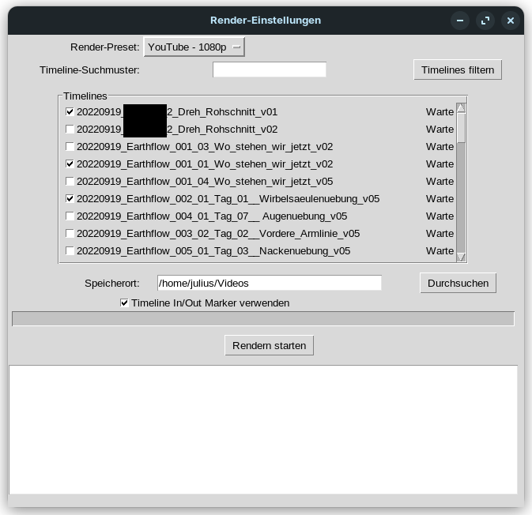

# Timelines to Encoding Queue – Render Manager for DaVinci Resolve

This tool acts as a Timeline Render Manager for DaVinci Resolve, allowing you to automatically add multiple timelines to the encoding queue.
You can filter timelines by name and either use presets or define custom encoder settings like bitrate, format, or resolution.

> 🖥 Supports **DaVinci Resolve Studio only**
> 
> ✅ GUI for both **Windows (Python 3)** and **Linux (Python 2.7)** included

---

## 🔧 Features

- Filter timelines by name (e.g., `_v01`, `Final`, `cut1`)
- Add multiple timelines to the render queue with one click
- GUI for selecting projects, timelines, render presets, and output settings
- Custom resolution, bitrate, codec & format possible
- Logging status
- Saves previous settings

---

## 📁 Folder Structure

- `release/`
  - `linux/` → Python 2 scripts for Linux (GUI & shell start scripts)
  - `win/` → Python 3 scripts for Windows (stable versions with GUI)
  - `win/nightly/` → Python 3 scripts for Windows (nightly versions with GUI)
- `Screenshots/` → GUI screenshots for documentation
- `alternativ/` → Experimental alternative GUI versions for Linux
- Root contains quick launchers & legacy scripts.

---

## 💻 Installation

### Windows (Python 3.x, DaVinci Resolve Studio)

1. **Install Python 3.x**: https://www.python.org/downloads/
2. Install `tkinter` via:

    ```bash
    pip install tk
    ```

3. Go to `release/win/` and use e.g.:
    - `nightly/search_in_timelines_and_encode_GUI_py3_win_nightly_02b_EN.py` (English) for more feature GUI
    - Optional: Use `Encodingmanager_EN.py` for stable GUI

4. Run the script **inside DaVinci Resolve** via Console:
    - Menu: `Workspace > Console > Python 3`
    - Paste the content of the .py script and press Enter

---

### Linux (Python 2.7, DaVinci Resolve Studio)

1. Install dependencies:

    ```bash
    sudo apt install python2 python-tk
    ```

2. Navigate to `release/linux/` and run:

```bash
./run_encoding_manager_a.sh
```

This calls `search_in_timelines_and_encode_GUI.py`, the full GUI version.
Alternatively, run manually:

```bash
python2 search_in_timelines_and_encode_GUI_alternativ_d.py
```

If you use Anaconda:

```bash
conda create -n drencode python=2.7
conda activate drencode
python search_in_timelines_and_encode_GUI_alternativ_d.py
```

---

## ▶ How to Use

1. Open **DaVinci Resolve Studio** and load your project.
2. Go to the **Deliver** page.
3. Set render settings (format, codec, etc.)
4. Set filename option to **Timeline name**
5. Run the script (GUI appears)
6. Choose project, output folder, render preset or custom config
7. Enter search term (e.g., `_v05`) → Click **Filter**
8. Select timelines → Click **Add to Queue**
9. Click **Start Rendering**

---


## 🧩 Dependencies

| Platform | Version | Required | Notes |
|---------|---------|----------|-------|
| Python 3 | Windows | ✅ | Required for Windows GUIs |
| Python 2.7 | Linux | ✅ | Needed for older DaVinci scripting |
| tkinter | All | ✅ | Install with Python or OS package manager |

---

## 📁 Project Variants

| Script | Platform | Language | UI | Path |
|--------|----------|----------|----|------|
| `search_in_timelines_and_encode_GUI_py3_win_nightly_02b_EN.py` | Windows | EN | ✅ | `release/win/nightly/` |
| `Encodingmanager_EN.py` | Windows | EN | ✅ | `release/win/nightly/` |
| `search_in_timelines_and_encode_GUI_alternativ_d.py` | Linux | DE | ✅ | `release/linux/` |
| `search_in_timelines_and_encode_non_studio.py` | All | EN | ❌ | root (legacy) |

---

## 📝 License

MIT License

---

## 📺 Demo

[](http://www.youtube.com/watch?v=iSUb798p8DM)

---
## 📷 Screenshots

### GUI (Windows, EN)


### GUI (Linux)


### DaVinci Resolve


---

For issues or suggestions, open a GitHub issue or visit [phantomcrew.de](https://phantomcrew.de)
